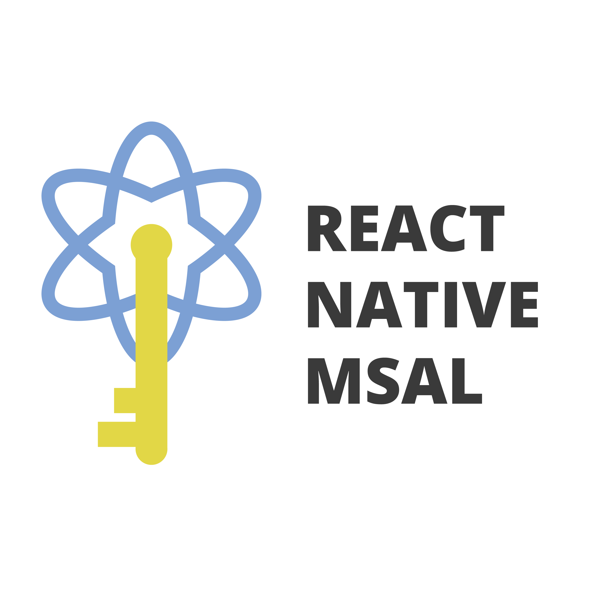

# react-native-msal

[](https://www.npmjs.com/package/react-native-msal)
[](https://www.npmjs.com/package/react-native-msal)

[](https://github.com/semantic-release/semantic-release)

<p align="center">
  
</p>

## Live Demo (Web)

[https://stashenergy.github.io/react-native-msal/](https://stashenergy.github.io/react-native-msal/)

## Table of Contents

- [Install](#install)
- [Setup](#setup)
- [Use](#use)
  - [PublicClientApplication class](#publicClientApplication-class)
  - [B2C Applications](#b2c-applications)
- [Example app](#example-app)
- [Migrating from v2 to v3](#migrating-from-v2-to-v3)

## Install

**Requires React Native >=0.61**

Stable version:  
`$ yarn add react-native-msal`

Beta version:  
`$ yarn add react-native-msal@beta`

Don't forget to run `npx pod-install` after!

## Setup

1. Register your application in the Azure Portal
2. Follow the [Android Setup](/docs/android_setup.md) steps
3. Follow the [iOS Setup](/docs/ios_setup.md) steps

## Use

### `PublicClientApplication` class

This class is designed to be a thin wrapper around the native functionality of the Android and iOS MSAL libraries.

#### Creating an instance

```typescript
import PublicClientApplication, { MSALConfiguration } from 'react-native-msal';

const config: MSALConfiguration = {
  auth: {
    clientId: 'your-client-id',
    // authority: 'default-authority',
  },
};

// Option 1: Constructor calls an asynchronous init method for you, but you won't know when it's done and can't catch errors
const pca = new PublicClientApplication(config);

// Option 2: Skips init, so you can call it yourself and handle errors
const pca = new PublicClientApplication(config, false);
try {
  await pca.init();
} catch (error) {
  console.error('Problem in configuration/setup:', error);
}
```

If you don't provide an authority, the common one will be used. This authority will be used as the default for calls to `acquireToken` and `acquireTokenSilent`.

#### Signing in interactively

```typescript
const params: MSALInteractiveParams = {
  scopes: ['scope1', 'scope2'],
};
const result: MSALResult = await pca.acquireToken(params);
```

You must use this method before any calls to `acquireTokenSilent`.
Use the `accessToken` from the MSALResult to call your API.
Store the `account` from the result for acquiring tokens silently or for removing the account.

#### Acquiring tokens silently

```typescript
const params: MSALSilentParams = {
  scopes: ['scope1', 'scope2'],
  account: result.account,
  // forceRefresh: true,
};
const result = await pca.acquireTokenSilent(params);
```

You can force the token to refresh with the `forceRefresh` option

#### Listing all accounts for which the application has refresh tokens

```typescript
const accounts: MSALAccount[] = await pca.getAccounts();
```

Instead of storing the `account` from a MSALResult for an `acquireTokenSilent` method call, you can filter the MSALAccount[] result for a particular account and use it.

#### Signing out

```typescript
const res: boolean = await pca.removeAccount(result.account);
```

Alternatively, you can call the `signOut` method:

```typescript
const params: MSALSignoutParams = {
  account: result.account,
  // signoutFromBrowser: true
};
const res: boolean = await pca.signOut(params);
```

On Android, this is the same as `removeAccount`, but on iOS, if you call it with `signoutFromBrowser: true`, it will sign you out of the browser as well.

### B2C Applications

The `PublicClientApplication` class is a bit too bare bones for dealing with a B2C application, and you will need to write a bit of code to get the desired behavior.

To address this issue, the example app that is included in this repository includes a [`B2CClient` class](./example/src/b2cClient.ts) which contains a lot of the functionality you will need for a B2C app. You can copy this class right into your own React Native app and modify it to your liking. You can see it being used in the example's [`App.tsx`](./example/src/App.tsx)

If you would like to see this class included in the library itself, please let us know.

## Example App

As mentioned above, the example app demonstrates a B2C implementation

To run the example locally, first clone the repo and run `$ yarn bootstrap` to install the depedencies. Then run the following for the desired platform:

iOS: `$ yarn example ios`  
Android: `$ yarn example android`  
Web: `$ yarn example web` (the example app is also running live [here](https://stashenergy.github.io/react-native-msal/))

If you want to run the example using your own Azure application information:

1. Register the redirect URLs in your tenant:
   - Android: `msauth://com.example/Xo8WBi6jzSxKDVR4drqm84yr9iU%3D`
   - iOS: `msauth.com.example://auth`
   - Web (SPA): `http://localhost:19006`
1. Update the `b2cConfig` and `b2cScopes` variables in `msalConfig.ts` with your details.
1. Update the `msal_config.json` Android asset file with your details.

## Migrating from v2 to v3

See breaking changes in [CHANGELOG.md](CHANGELOG.md#300).
