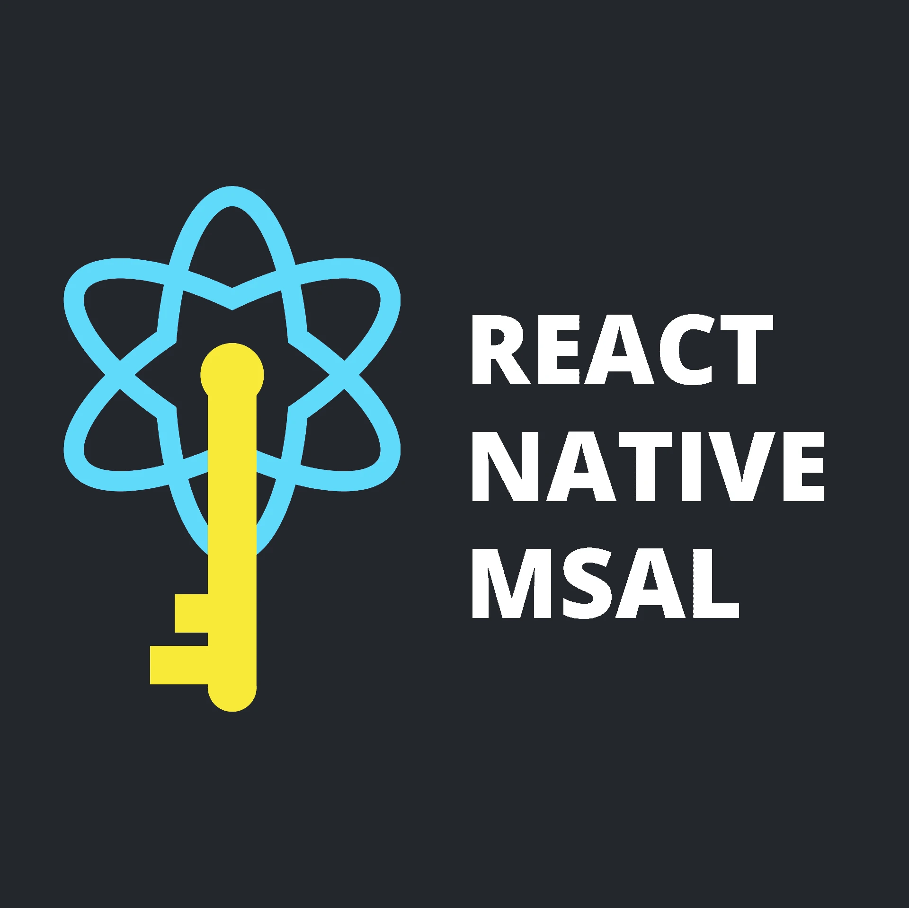

# react-native-msal

[](https://www.npmjs.com/package/react-native-msal)
[](https://www.npmjs.com/package/react-native-msal)

[](https://github.com/semantic-release/semantic-release)

<p align="center">
  
</p>

## Live Demo (Web)

[https://stashenergy.github.io/react-native-msal/](https://stashenergy.github.io/react-native-msal/)

## Table of Contents

- [Install](#install)
- [Setup](#setup)
- [Use](#use)
  - [PublicClientApplication class](#publicClientApplication-class)
  - [B2C Applications](#b2c-applications)
- [Example app](#example-app)
- [Migrating between major versions](#migrating-between-major-versions)

## Install

**Requires React Native >=0.61**

Stable version:
`$ yarn add react-native-msal`

Beta version:
`$ yarn add react-native-msal@beta`

Don't forget to run `npx pod-install` after!

## Setup

### Expo

Follow the [Expo setup guide](/docs/expo_setup.md)

### Non-expo

Follow the [Android setup guide](/docs/android_setup.md) and the [iOS setup guide](/docs/ios_setup.md)

## Use

```typescript
import PublicClientApplication from 'react-native-msal';
import type { MSALConfiguration /*, etc */ } from 'react-native-msal';

const config: MSALConfiguration = {
  auth: {
    clientId: 'your-client-id',
    // This authority is used as the default in `acquireToken` and `acquireTokenSilent` if not provided to those methods.
    // Defaults to 'https://login.microsoftonline.com/common'
    authority: 'https://<authority url>',
  },
};
const scopes = ['scope1', 'scope2'];

// Initialize the public client application:
const pca = new PublicClientApplication(config);
try {
  await pca.init();
} catch (error) {
  console.error('Error initializing the pca, check your config.', error);
}

// Acquiring a token for the first time, you must call pca.acquireToken
const params: MSALInteractiveParams = { scopes };
const result: MSALResult | undefined = await pca.acquireToken(params);

// On subsequent token acquisitions, you can call `pca.acquireTokenSilent`
// Force the token to refresh with the `forceRefresh` option
const params: MSALSilentParams = {
  account: result!.account, // or get this by filtering the result from `pca.getAccounts` (see below)
  scopes,
  forceRefresh: true,
};
const result: MSALResult | undefined = await pca.acquireTokenSilent(params);

// Get all accounts for which this application has refresh tokens
const accounts: MSALAccount[] = await pca.getAccounts();

// Retrieve the account matching the identifier
const account: MSALAccount | undefined = await pca.getAccount(result!.account.identifier);

// Remove all tokens from the cache for this application for the provided account
const success: boolean = await pca.removeAccount(result!.account);

// Same as `pca.removeAccount` with the exception that, if called on iOS with the `signoutFromBrowser` option set to true, it will additionally remove the account from the system browser
const params: MSALSignoutParams = {
  account: result!.account,
  signoutFromBrowser: true,
};
const success: boolean = await pca.signOut(params);
```

### B2C Applications

The `PublicClientApplication` class is a bit too bare bones for dealing with a B2C application, and you will need to write a bit of code to get the desired behavior.

To address this issue, the example app that is included in this repository includes a [`B2CClient` class](./example/src/b2cClient.ts) which contains a lot of the functionality you will need for a B2C app. You can copy this class right into your own React Native app and modify it to your liking. You can see it being used in the example's [`App.tsx`](./example/src/App.tsx)

If you would like to see this class included in the library itself, please let us know.

## Example App

As mentioned above, the example app demonstrates a B2C implementation

To run the example locally, first clone the repo and run `$ yarn` to bootstrap the project. Then run the following for the desired platform:

iOS: `$ yarn example ios`
Android: `$ yarn example android`
Web: `$ yarn example web` (the example app is also running live [here](https://stashenergy.github.io/react-native-msal/))

If you want to run the example using your own Azure application information:

1. Register the redirect URLs in your tenant:
   - Android: `msauth://com.example/Xo8WBi6jzSxKDVR4drqm84yr9iU%3D`
   - iOS: `msauth.com.example://auth`
   - Web (SPA): `http://localhost:19006`
1. Update the `b2cConfig` and `b2cScopes` variables in `msalConfig.ts` with your details.

## Migrating between major versions

See migration instructions in the [CHANGELOG](CHANGELOG.md).
